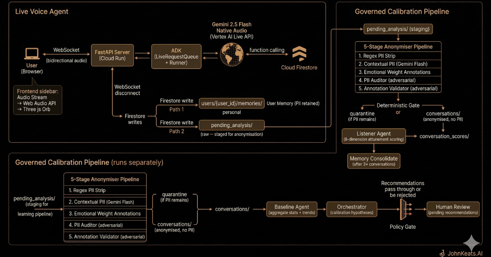

# JohnKeats.AI

A voice-first AI companion that holds uncertainty instead of solving it. Built on Gemini 2.5 Flash Native Audio with a governed calibration pipeline that learns from every conversation.

**Built for the Gemini Live Agent Challenge.**

## Live Demo

[johnkeats.ai](https://johnkeats.ai)

## Demo Video

[YouTube](https://youtu.be/zNKhR3e2ym4)

## What It Is

A voice agent with one rule: hold, don't solve. The user speaks. Keats listens. It reflects back what was said — especially the things the user didn't realise they said. It doesn't offer solutions, action plans, or next steps unless asked three times.

The interface is a breathing orb on a black screen. No chat UI. No avatar. Audio-reactive — pulses when Keats speaks, shifts cool when the user speaks, goes still in silence.

Behind the conversation, a governed calibration pipeline anonymises transcripts, scores Keats's attunement quality across six dimensions, and generates calibration recommendations under human review. The voice agent never depends on the learning loop. If the pipeline breaks, the product works exactly as before.

## Architecture



**Backend:** FastAPI server on Cloud Run handles WebSocket connections. The Google ADK manages bidirectional audio streaming with the Gemini model. Four Firestore tools handle the user's "Dark Passage" — a constellation of saved uncertainties.

**Model:** Gemini 2.5 Flash Native Audio via the Vertex AI Live API. Native audio means the model hears tone, pace, and hesitation — not just transcribed words. This enables affective dialogue: Keats slows down when you sound anxious, stays steady when you're angry, comes closer when you're numb.

**Frontend:** Vanilla JavaScript and Three.js render a breathing orb on a black screen. The orb's state is driven by the conversation: it pulses when Keats speaks, shifts cool when you speak, and dims into slow breathing during silence.

## Tech Stack

- **Backend:** Python 3.11, FastAPI, Google ADK, google-genai, google-cloud-firestore
- **Model:** Gemini 2.5 Flash Native Audio (Vertex AI Live API)
- **Frontend:** Vanilla JS, Three.js (r128), Web Audio API
- **Storage:** Google Cloud Firestore
- **Deployment:** Docker → Artifact Registry → Google Cloud Run
- **Streaming:** WebSocket bidirectional audio (ADK bidi-streaming)

## Local Development

1. Clone the repo:
```bash
git clone https://github.com/johnkeats-ai/johnkeats-ai.git
cd johnkeats-ai
```

2. Set up Python 3.11 environment:
```bash
python3.11 -m venv .venv
source .venv/bin/activate
```

3. Copy the example environment file and fill in your values:
```bash
cp .env.example backend/app/.env
```

Required variables:
```
GOOGLE_CLOUD_PROJECT=johnkeats-ai
GOOGLE_CLOUD_LOCATION=us-central1
GOOGLE_GENAI_USE_VERTEXAI=TRUE
KEATS_VOICE_NAME=Achird
```

4. Install dependencies:
```bash
cd backend/app
pip install -e .
```

5. Set SSL certificate path:
```bash
export SSL_CERT_FILE=$(python -m certifi)
```

6. Run the server:
```bash
uvicorn main:app --reload --host 0.0.0.0 --port 8000
```

7. Open [http://localhost:8000](http://localhost:8000) in your browser.

## Running the Calibration Pipeline

After having conversations with Keats, process the accumulated transcripts:

```bash
cd backend/app
export GOOGLE_CLOUD_PROJECT=johnkeats-ai
export GOOGLE_CLOUD_LOCATION=us-central1
export GOOGLE_GENAI_USE_VERTEXAI=TRUE
python3 -m agents.handshake
```

This runs the full pipeline: anonymisation → scoring → consolidation → baseline → orchestrator → policy gate.

## Cloud Deployment

Requires a GCP project with Vertex AI, Firestore, Cloud Run, and Artifact Registry APIs enabled.

```bash
./deploy.sh
```

## Project Structure

```
johnkeats-ai/
├── backend/app/
│   ├── keats_agent/
│   │   ├── __init__.py
│   │   └── agent.py              # Voice agent definition + system prompt
│   ├── tools/
│   │   ├── __init__.py
│   │   └── passage_tools.py      # Firestore tools (save/retrieve/resolve uncertainties)
│   ├── agents/
│   │   ├── anonymiser.py         # 3-pass PII anonymisation
│   │   ├── pii_auditor.py        # Adversarial PII re-identification review
│   │   ├── annotation_validator.py # Adversarial emotional weight validation
│   │   ├── anonymiser_gate.py    # Deterministic gate (quarantine/proceed)
│   │   ├── listener_agent.py     # 6-dimension attunement scoring
│   │   ├── memory_ingest.py      # Emotional marker extraction
│   │   ├── memory_consolidate.py # Cross-conversation pattern detection
│   │   ├── memory_query.py       # Dual-source context retrieval
│   │   ├── user_memory.py        # Per-user conversation persistence
│   │   ├── baseline_agent.py     # Aggregate stats and trend analysis
│   │   ├── orchestrator_agent.py # Calibration hypothesis generation
│   │   ├── policy_gate.py        # Deterministic behavioural boundary enforcement
│   │   ├── run_analysis.py       # Manual pipeline runner
│   │   ├── handshake.py          # Scheduled batch processor
│   │   └── prompts/              # All agent prompts as readable markdown
│   │       ├── README.md
│   │       ├── anonymiser-contextual.md
│   │       ├── pii-auditor.md
│   │       ├── listener-emotional-match.md
│   │       ├── orchestrator.md
│   │       └── ...
│   ├── static/
│   │   ├── css/style.css
│   │   ├── js/
│   │   │   ├── app.js            # WebSocket + state machine
│   │   │   ├── orb.js            # Three.js breathing orb
│   │   │   ├── audio-player.js
│   │   │   ├── audio-recorder.js
│   │   │   └── ...
│   │   └── index.html
│   ├── main.py                   # FastAPI + WebSocket handler
│   └── pyproject.toml
├── knowledge-base/
│   ├── kb-01-keats-philosophy.txt
│   ├── kb-02-conversation-patterns.txt
│   ├── kb-03-user-antipatterns.txt
│   └── kb-04-boundaries-and-safety.txt
├── docs/
│   ├── architecture.png
│   └── firestore-screenshots/
├── deploy.sh
├── Dockerfile
├── .env.example
└── README.md
```

## Knowledge Base

The `knowledge-base/` directory contains four reference documents:

- **kb-01:** Keats' philosophical framework — negative capability, the Mansion of Many Apartments, the vale of soul-making
- **kb-02:** Conversation patterns — signature moves, emotional matching, conversation closings
- **kb-03:** User anti-patterns — ten common certainty-seeking patterns with reframe directions
- **kb-04:** Boundaries and safety — crisis protocol, therapy boundaries, hostility handling, character integrity

## Tools

Four Firestore-backed tools power the agent's memory:

- **save_to_passage** — silently saves a user's core uncertainty when they articulate it
- **get_passage_history** — retrieves recent uncertainties to inform listening (never read back to user)
- **resolve_uncertainty** — marks an uncertainty as resolved when the user indicates closure
- **crisis_resources** — provides localised crisis support information (fires only on explicit self-harm or suicidal expression)

## Governed Calibration Pipeline

Fourteen agents processing conversations through two data paths:

**Path 1:** User Memory — full transcript with PII retained, per-user isolation. Keats remembers who you are across sessions.

**Path 2:** Anonymised Learning — five-stage anonymisation, adversarial audit, emotional weight annotation. Scored across six attunement dimensions. Cross-conversation pattern detection generates calibration hypotheses filtered by a deterministic policy gate. All recommendations require human approval.

Agent prompts are extracted to `backend/app/agents/prompts/` as readable markdown for auditability.

Principle Zero: the voice agent never depends on the learning loop.

## Blog Post

[dev.to](https://dev.to/keatsian-ai/building-a-philosophical-ai-companion-in-48-hours-with-gemini-and-google-cloud-5hl0)

## License

MIT
